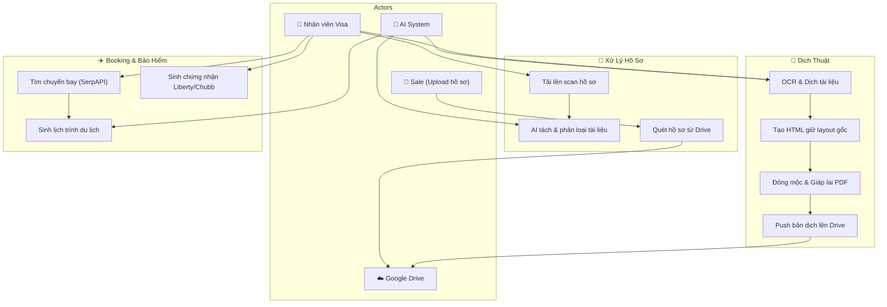
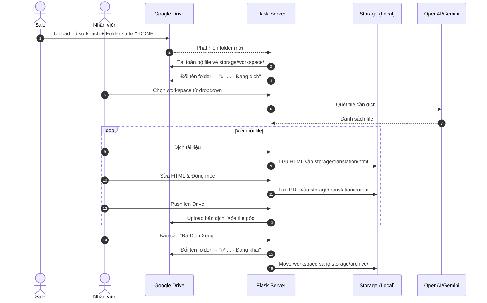
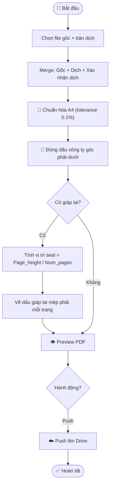

# 🛂 AI Visa Agent — Multi-Agent Automation System

Hệ thống multi-agent AI tự động hóa toàn bộ quy trình hồ sơ VISA: đọc tài liệu, phân loại, tách/ghép PDF, dịch thuật, tạo booking khách sạn & vé máy bay, lên lịch trình, sinh bảo hiểm du lịch, và viết thư giải trình song ngữ (VI/EN).

> **Tech Stack**: Python 3.10+ · Flask · SQLite/SQLAlchemy · OpenAI GPT-4o · Google Gemini · PyMuPDF · Vanilla JS · Google Drive API

---

## 📑 Mục Lục

- [⚡ Cài đặt nhanh](#-cài-đặt-nhanh)
- [🔑 Cấu hình hệ thống](#-cấu-hình-hệ-thống)
- [📂 Cấu trúc Storage Tập Trung](#-cấu-trúc-storage-tập-trung-mới)
- [🖥️ 9 Tabs Chức Năng](#️-9-tabs-chức-năng)
- [📊 Use Case Diagram](#-use-case-diagram)
- [🔄 Sequence Diagrams](#-sequence-diagrams)
- [📈 Activity Diagrams](#-activity-diagrams)
- [📐 Kiến trúc hệ thống](#-kiến-trúc-hệ-thống)
- [📂 Cấu trúc dự án](#-cấu-trúc-dự-án)
- [📝 Database & Cơ chế Cleanup](#-database--cơ-chế-cleanup)

---

## ⚡ Cài đặt nhanh

**Yêu cầu**: Python 3.10+ ([tải tại đây](https://www.python.org/downloads/)) — nhớ tích ✅ "Add Python to PATH".

```powershell
# 1. Clone repo
git clone <url-repo>
cd AI-AGENT-FOR-WRITING-VISA-EXPLANATION-LETTERS

# 2. Tạo môi trường ảo & cài thư viện
python -m venv myenv
myenv\Scripts\activate
pip install -r requirements.txt

# 3. Cấu hình
copy .env.example .env
# Mở .env và điền các api keys (OPENAI_API_KEY, v.v)

# 4. Cấp quyền Google Drive (Quan trọng cho Tính năng Đồng bộ)
# Tải file client_secret.json bỏ vào thư mục gốc của project ngang hàng với server.py.
# ⚠️ KHÔNG BAO GIỜ push client_secret.json và token.json lên github.

# 5. Chạy server
python server.py
```

Mở trình duyệt: **http://127.0.0.1:8000**

---

## 🔑 Cấu hình hệ thống

Quản lý thông qua file `.env` và truy cập qua `config.py`:

| Biến                  | Mô tả                                           | Bắt buộc |
| --------------------- | ------------------------------------------------ | -------- |
| `OPENAI_API_KEY`      | API key OpenAI                                   | ✅       |
| `GEMINI_API_KEY`      | API key Google Gemini (fallback khi OpenAI hết quota) | ❌   |
| `SERPAPI_KEY`         | API key SerpAPI cho tìm chuyến bay               | ❌       |

---

## 📂 Cấu trúc Storage Tập Trung (MỚI)

Tất cả dữ liệu sinh ra trong quá trình hệ thống chạy (runtime data) giờ đây được quản lý tập trung hoàn toàn trong thư mục `storage/`. Điều này giúp root project sạch sẽ và dễ backup.

```text
storage/
├── input/             ← File upload thủ công
├── output/            ← File PDF tổng hợp sau khi xử lý
├── uploads/           ← (Chứa translation_originals) File gốc upload cho dịch thuật
├── splitter/          ← Kết quả sau khi AI Splitter tách file
├── scan_splitter/     ← Kết quả tách file theo scan
├── insurance/         ← PDF Bảo hiểm sau khi sinh (Chubb, Liberty)
├── translation/
│   ├── templates/     ← Chứa các HTML template cố định cho dịch thuật
│   ├── html/          ← File HTML sau khi dịch
│   └── output/        ← File PDF sau khi đóng mộc / giáp lai
├── workspace/         ← Nơi lưu các hồ sơ dịch thuật tự động tải từ Google Drive
└── archive/           ← (Khai Imm) Lưu trữ các hồ sơ đã hoàn thành dịch thuật
```

> **Cơ chế dọn dẹp**: Hệ thống hỗ trợ **Cascade Delete**. Khi xóa một `Project` trên giao diện Database, toàn bộ file vật lý tương ứng của project đó trong thư mục `storage/` cũng sẽ tự động bị xóa, ngăn chặn tình trạng rác ổ cứng.

---

## 🖥️ 9 Tabs Chức Năng

| Tab | Chức năng | Mô tả |
|-----|-----------|-------|
| ① Xử lý hồ sơ | AI Splitter + Classifier | Upload scan nhiều trang → AI tự nhận diện + tách + phân loại từng tài liệu |
| ② Tách/Nối PDF | PDF Tools | Trộn/Merge nhiều file, rename theo format danh mục Đại sứ quán, rút trích trang |
| ③ Booking | Chuyến bay & Khách sạn | Tích hợp SerpAPI chuyến bay → Auto-check-in khách sạn liên hoàn, vé Multi-city |
| ④ Lịch trình | Travel Itinerary | Sinh lịch trình du lịch chi tiết từng ngày khớp hoàn toàn vé máy bay / khách sạn |
| ⑤ Bảo Hiểm | Chubb / Liberty | Sinh chứng nhận bảo hiểm du lịch (Redaction + Text Insert trên PDF template) |
| ⑥ Thư giải trình | AI Cover Letter | Đọc hiểu background người nộp → Viết Cover Letter chuẩn đại sứ quán (Vi/En) |
| ⑦ Kết quả | Output Manager | Quản lý toàn bộ outputs, xem trước, gộp chung, tải xuống ZIP |
| ⑧ Dịch thuật | Translation Engine | Dịch tài liệu (Khai sinh, Tư pháp...) giữ nguyên layout HTML + Đóng mộc & Giáp lai |
| ⑨ Sửa PDF | PDF Editor | Can thiệp chỉnh sửa metadata và fill các form điền tay |

---

## 📊 Use Case Diagram



---

## 🔄 Sequence Diagrams

### Quy trình Dịch Thuật (Google Drive Sync & Stamp)



---

## 📈 Activity Diagrams

### Luồng Đóng Mộc & Giáp Lai PDF



---

## 📐 Kiến trúc hệ thống

- **Frontend**: Vanilla JS, giao diện chia theo Tabs.
- **Backend**: Flask (Python).
- **Core Engine**: Sử dụng PyMuPDF (`fitz`) để manipulate file PDF (Merge, Redact, Insert, Draw Image).
- **AI Integration**: Langchain/OpenAI API + Fallback sang Google Gemini nếu hết Quota (429 Error).
- **Browser Automation**: Thư mục `extensions/` chứa các plugin autofill cho trang web của lãnh sự quán (ImmiAccount Úc, DS160 Mỹ).

---

## 📂 Cấu trúc dự án

```text
├── server.py                  ← Entry point / Khởi chạy Flask
├── config.py                  ← Config tập trung (Quản lý toàn bộ đường dẫn)
├── database.py                ← SQLite + SQLAlchemy
├── requirements.txt           
│
├── core/                      ← Kho lõi AI (Agents, Prompts, Helpers)
├── routes/                    ← API Layer (Flask Blueprints)
├── services/                  ← Business Logic (Bảo hiểm, Random code)
├── pdf_tools/                 ← Đóng mộc, Giáp lai, Redaction engine
├── sync/                      ← Google Drive UI hacker & Watcher
├── classifier/                ← AI document classification
│
├── extensions/                ← (MỚI) Chrome Extensions tự động điền form
│   ├── autofill-australia/    ← ImmiAccount (Úc)
│   └── autofill-ds160/        ← DS-160 (Mỹ)
│
├── frontend/                  ← Web UI (HTML, CSS, JS)
│   ├── index.html             
│   └── js/                    ← Các JS modules quản lý state
│
├── templates/                 ← PDF templates (Bảo hiểm)
├── storage/                   ← (MỚI) Toàn bộ runtime data (input, output, workspace, archive...)
└── tests/                     ← Pytest suite
```

---

## 📝 Database & Cơ chế Cleanup

Sử dụng SQLite qua `SQLAlchemy` với các model chính:

- `Project`: Đại diện cho một hồ sơ Visa.
- `Booking`, `Itinerary`, `LetterState`: Các state của quá trình gen AI.
- `TranslationFlow`: Quản lý tiến độ dịch của từng file (Đang dịch, Done).

> **Cascade Deletion (Mới Cập Nhật)**: 
> Trong `routes/projects.py`, khi người dùng gọi API Xóa `Project`, hệ thống không chỉ xóa dòng record trong database, mà còn tự động quét và xóa sạch các file vật lý thuộc về project đó nằm rải rác trong `storage/splitter/` và `storage/uploads/`. Điều này giải quyết triệt để vấn đề rác dữ liệu tốn dung lượng ổ cứng.
