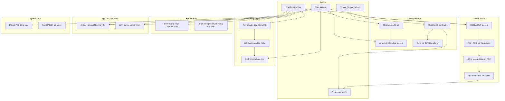
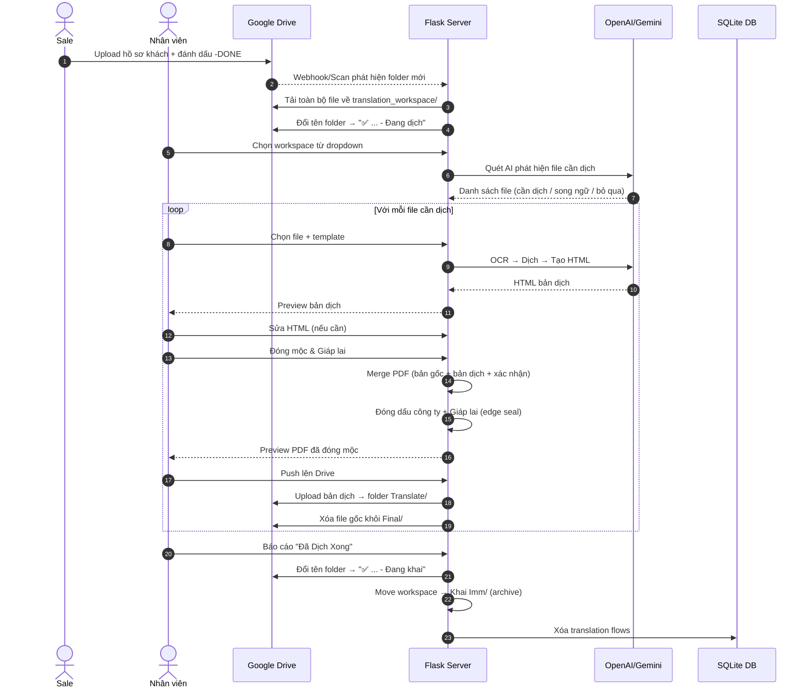
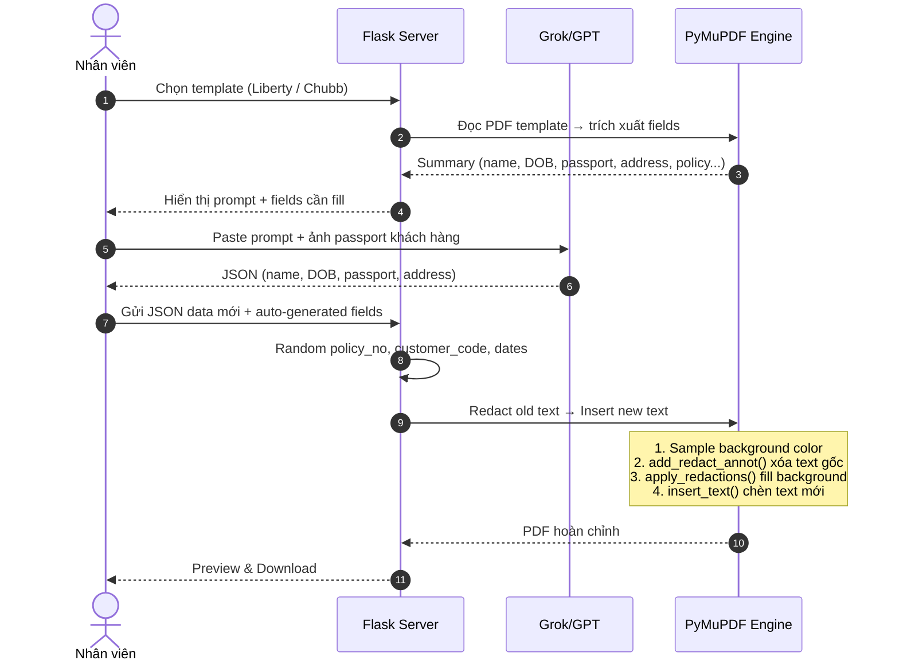
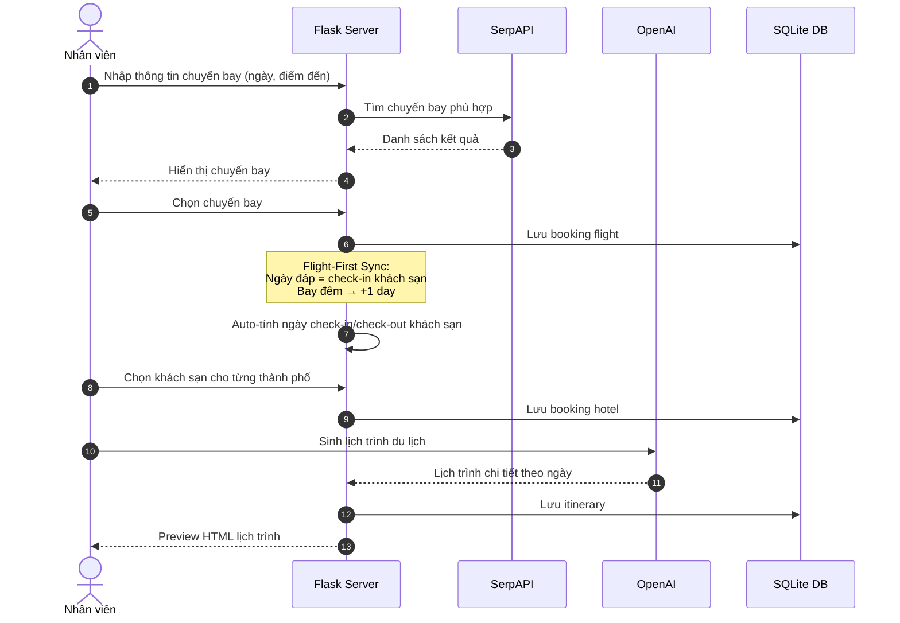
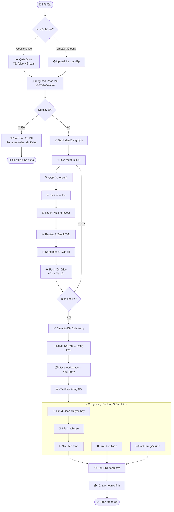
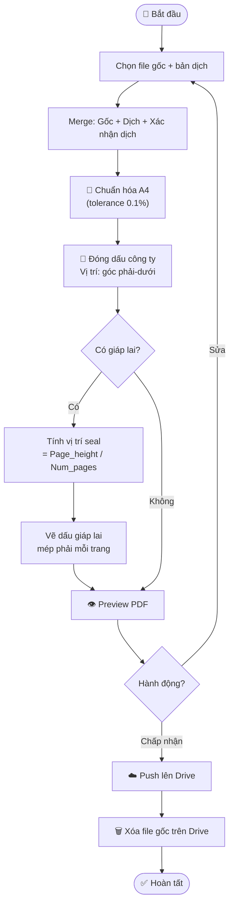
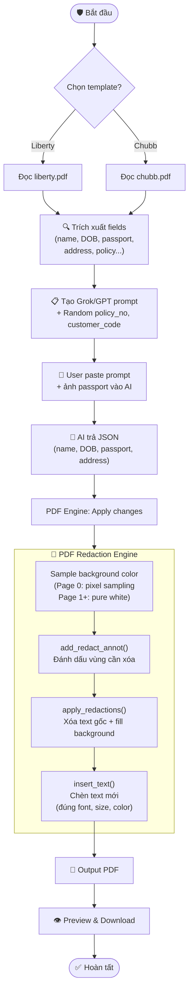

# 🛂 AI Visa Agent — Multi-Agent Automation System

Hệ thống multi-agent AI tự động hóa toàn bộ quy trình hồ sơ VISA: đọc tài liệu, phân loại, tách/ghép PDF, dịch thuật, tạo booking khách sạn & vé máy bay, lên lịch trình, sinh bảo hiểm du lịch, và viết thư giải trình song ngữ (VI/EN).

> **Tech Stack**: Python 3.10+ · Flask · SQLite/SQLAlchemy · OpenAI GPT-4o · Google Gemini · PyMuPDF · Vanilla JS · Google Drive API

---

## 📑 Mục Lục

- [⚡ Cài đặt nhanh](#-cài-đặt-nhanh)
- [🔑 Biến môi trường](#-biến-môi-trường-env)
- [🖥️ 9 Tabs Chức Năng](#️-9-tabs-chức-năng)
- [📊 Use Case Diagram](#-use-case-diagram)
- [🔄 Sequence Diagrams](#-sequence-diagrams)
- [📈 Activity Diagrams](#-activity-diagrams)
- [📐 Kiến trúc hệ thống](#-kiến-trúc-hệ-thống)
- [📂 Cấu trúc dự án (Mới Cập Nhật)](#-cấu-trúc-dự-án)
- [🧾 API Endpoints](#-api-endpoints)
- [📝 Database](#-database)
- [🧪 Tests](#-chạy-tests)
- [📝 Ghi chú kỹ thuật](#-ghi-chú-kỹ-thuật-dành-cho-developer)

---

## ⚡ Cài đặt nhanh

**Yêu cầu**: Python 3.10+ ([tải tại đây](https://www.python.org/downloads/)) — nhớ tích ✅ "Add Python to PATH".

```powershell
# 1. Clone repo
git clone <url-repo>
cd AI-AGENT-FOR-WRITING-VISA-EXPLANATION-LETTERS

# 2. Tạo môi trường ảo & cài thư viện
python -m venv myenv
myenv\Scripts\activate
pip install -r requirements.txt

# 3. Cấu hình
copy .env.example .env
# Mở .env và điền các api keys (OPENAI_API_KEY, v.v)

# 4. Cấp quyền Google Drive (Quan trọng cho Tính năng Đồng bộ)
# Tải file client_secret.json (Google Cloud Console -> APIs & Services -> Credentials -> OAuth 2.0 Client IDs (Desktop))
# Bỏ file client_secret.json vào thư mục gốc của project ngang hàng với server.py.
# Lần đầu chạy, hệ thống sẽ mở trình duyệt để xin quyền truy cập Drive và sinh ra file token.json.
# ⚠️ KHÔNG BAO GIỜ push client_secret.json và token.json lên github.

# 5. Chạy server
python server.py
```

Mở trình duyệt: **http://127.0.0.1:8000**

---

## 🔑 Biến môi trường (.env)

| Biến                  | Mô tả                                           | Bắt buộc |
| --------------------- | ------------------------------------------------ | -------- |
| `OPENAI_API_KEY`      | API key OpenAI                                   | ✅       |
| `OPENAI_MODEL`        | Model text reasoning (mặc định: `gpt-5-mini`)    | ❌       |
| `OPENAI_VISION_MODEL` | Model vision/OCR (mặc định: `gpt-4o-mini`)       | ❌       |
| `GEMINI_API_KEY`      | API key Google Gemini (fallback khi OpenAI hết quota) | ❌   |
| `GEMINI_MODEL`        | Model Gemini (mặc định: `gemini-1.5-flash`)      | ❌       |
| `SERPAPI_KEY`         | API key SerpAPI cho tìm chuyến bay               | ❌       |
| `GOOGLE_CREDENTIALS_PATH` | Đường dẫn tới file Google Credentials (mặc định: `client_secret.json`) | ❌ |

> **Lưu ý:** Tất cả config được quản lý tập trung qua `config.py` → class `Config`. Không cần gọi `os.getenv()` trực tiếp trong code.

---

## 🖥️ 9 Tabs Chức Năng

| Tab | Chức năng | Mô tả |
|-----|-----------|-------|
| ① Xử lý hồ sơ | AI Splitter + Classifier | Upload scan nhiều trang → AI tự nhận diện + tách + phân loại từng tài liệu |
| ② Tách/Nối PDF | PDF Tools | Trộn/Merge nhiều file, rename theo format danh mục Đại sứ quán, rút trích trang |
| ③ Booking | Chuyến bay & Khách sạn | Tích hợp SerpAPI chuyến bay → Auto-check-in khách sạn liên hoàn, vé Multi-city |
| ④ Lịch trình | Travel Itinerary | Sinh lịch trình du lịch chi tiết từng ngày khớp hoàn toàn vé máy bay / khách sạn |
| ⑤ Bảo Hiểm | Chubb / Liberty | Sinh chứng nhận bảo hiểm du lịch (Redaction + Text Insert trên PDF template) |
| ⑥ Thư giải trình | AI Cover Letter | Đọc hiểu background người nộp → Viết Cover Letter chuẩn đại sứ quán (Vi/En) |
| ⑦ Kết quả | Output Manager | Quản lý toàn bộ outputs, xem trước, gộp chung, tải xuống ZIP |
| ⑧ Dịch thuật | Translation Engine | Dịch tài liệu (Khai sinh, Tư pháp...) giữ nguyên layout HTML + Đóng mộc & Giáp lai |
| ⑨ Sửa PDF | PDF Editor | Can thiệp chỉnh sửa metadata và fill các form điền tay |

### 🌟 Các Điểm Khác Biệt & Nổi Bật

- **Cấu trúc Storage Mới (V2.0):** Toàn bộ dữ liệu sinh ra trong quá trình chạy được gom sạch sẽ vào mục `storage/` (chia theo `input/`, `output/`, `insurance/`, `translation/`, v.v), giúp root folder gọn gàng và dễ backup.
- **Cascade Delete:** Xóa hồ sơ (Project) từ cơ sở dữ liệu sẽ tự động dọn sạch file upload và output liên quan trên ổ cứng, không để lại rác (orphaned files).
- **Google Drive Integration:** Tự động quét → tải hồ sơ → AI phân loại → dịch → đóng mộc → push bản dịch lên Drive → xóa file gốc. Quy trình zero-touch.
- **Flight-First Sync:** Ngày đáp chuyến bay tự đồng bộ làm ngày check-in khách sạn, nhận diện bay đêm (timezone) cộng `+1 Day` check-in chính xác.
- **PDF Redaction Engine:** Sinh bảo hiểm Chubb/Liberty bằng `PyMuPDF` — xóa text gốc bằng Redaction, insert text mới với font/size/color y hệt original.
- **Đóng mộc & Giáp lai:** Tự động đóng dấu công ty + dấu giáp lai (edge seal) trên bản dịch PDF, chuẩn hóa A4. Kèm theo trang "Xác nhận dịch thuật" ở cuối tài liệu.
- **Chrome Extension Autofill:** Tự động điền tờ khai ImmiAccount (Úc), DS-160 (Mỹ), IMM5257/5645 (Canada) được gom chung vào folder `extensions/`.

---

## 📊 Use Case Diagram



---

## 🔄 Sequence Diagrams

### 1. Quy trình Dịch Thuật (Drive → Dịch → Đóng mộc → Push)



### 2. Quy trình Sinh Bảo Hiểm



### 3. Quy trình Booking & Lịch Trình



---

## 📈 Activity Diagrams

### 1. Luồng Tổng Thể Xử Lý Hồ Sơ Visa



### 2. Luồng Đóng Mộc & Giáp Lai PDF



### 3. Luồng Sinh Bảo Hiểm PDF



---

## 📐 Kiến trúc hệ thống

```text
┌──────────────────────────────────────────────────────────────────────────┐
│                         🌐 Frontend (Vanilla JS)                        │
│  ┌──────────┬──────────┬──────────┬──────────┬──────────┬──────────┐    │
│  │ Splitter │ PDF Tools│ Booking  │Insurance │Translate │ LetterGen│    │
│  │  .js     │  .js     │  .js     │  .js     │  .js     │  .js     │    │
│  └────┬─────┴────┬─────┴────┬─────┴────┬─────┴────┬─────┴────┬─────┘    │
│       │          │          │          │          │          │           │
│  ┌────┴──────────┴──────────┴──────────┴──────────┴──────────┴─────┐    │
│  │           workspace.js · events.js · push-to-drive.js           │    │
│  └─────────────────────────────┬───────────────────────────────────┘    │
└────────────────────────────────┼────────────────────────────────────────┘
                                 │ HTTP REST API
┌────────────────────────────────┼────────────────────────────────────────┐
│                         🐍 Flask Server                                 │
│  ┌─────────────────────────────┼───────────────────────────────────┐    │
│  │                    routes/ (28 files)                            │    │
│  │  ┌────────────┬────────────┬────────────┬────────────────────┐  │    │
│  │  │ splitter.py│booking*.py │insurance.py│ translate_*.py (4) │  │    │
│  │  │ pipeline.py│pipeline*.py│push_drive.py│ australia_forms.py│  │    │
│  │  └────────────┴────────────┴────────────┴────────────────────┘  │    │
│  └─────────────────────────────┬───────────────────────────────────┘    │
│                                │                                        │
│  ┌────────────┬────────────────┼────────────────┬──────────────────┐    │
│  │  core/     │  services/     │  pdf_tools/     │  sync/           │    │
│  │ agents.py  │ insurance/     │ stamper.py      │ drive_ui_hacker  │    │
│  │ prompts.py │  pdf_engine.py │ (mộc + giáp lai)│ (Drive API)     │    │
│  │ errors.py  │  prompts.py    │                 │                  │    │
│  │ helpers.py │  random_utils  │                 │                  │    │
│  └────────────┴────────────────┴────────────────┴──────────────────┘    │
│                                │                                        │
│  ┌─────────────────────────────┼───────────────────────────────────┐    │
│  │              External Services & Storage                        │    │
│  │  ┌──────────┬──────────┬──────────┬────────────┬──────────┐    │    │
│  │  │ OpenAI   │ Gemini   │ SerpAPI  │GoogleDrive │ SQLite   │    │    │
│  │  │ GPT-4o   │ 1.5Flash │ Flights  │  OAuth2    │ DB       │    │    │
│  │  └──────────┴──────────┴──────────┴────────────┴──────────┘    │    │
│  └─────────────────────────────────────────────────────────────────┘    │
└────────────────────────────────────────────────────────────────────────┘
```

### Bảo mật (Security)
- **Zero-Git-Tracking**: Hồ sơ visa (Passport, CMND, Sao kê) KHÔNG bao giờ push lên git — `.gitignore` cấu hình đầy đủ.
- **Dynamic Load Balancing**: Fallback thông minh OpenAI → Gemini khi cạn Rate Limit.
- **Request Optimization**: Ảnh Resize & nén JPEG 80% tiết kiệm tokens.
- **Caching**: Request đắt tiền được cache xuống `output/cache`.
- **Khai Imm/ Archive**: Workspace đã dịch xong được move (không xóa) vào `Khai Imm/` — cũng nằm trong `.gitignore`.

---

## 📂 Cấu trúc dự án

```text
├── server.py                  ← Entry point / Khởi chạy Flask
├── config.py                  ← Config tập trung (class Config)
├── database.py                ← SQLite + SQLAlchemy (6 models)
├── requirements.txt           ← Dependencies & thư viện
│
├── core/                      ← Kho lõi AI
│   ├── agents.py              ← AI Agents (Vision OCR, Document Analysis)
│   ├── prompts.py             ← Prompt Templates (Prompt Engineering)
│   ├── helpers.py             ← Utility functions (model selection, etc.)
│   └── errors.py              ← Error handling (QuotaExhaustedError, 429)
│
├── routes/                    ← API Layer (Flask Blueprints - 28 files)
│   ├── splitter.py            ← AI PDF splitter
│   ├── booking*.py            ← Booking (SerpAPI, Hotel, Ticket Gen)
│   ├── insurance.py           ← Insurance certificate generation
│   ├── translate_core.py      ← Translation shared config & helpers
│   ├── translate_api.py       ← Translation CRUD, workspace scan
│   ├── translate_stamp.py     ← Stamp, seal, push-to-drive
│   ├── splitter_translate.py  ← Translation flow management
│   ├── push_to_drive.py       ← Google Drive upload/sync
│   └── pipeline*.py           ← Cover Letter & PDF pipelines
│
├── services/                  ← Business Logic Layer
│   └── insurance/
│       ├── pdf_engine.py      ← PDF Redaction Engine (extract, replace, render)
│       ├── prompts.py         ← AI prompt builder for insurance
│       ├── random_utils.py    ← Random policy/code generators
│       └── liberty_api.py     ← Liberty Insurance pricing API
│
├── pdf_tools/                 ← PDF utilities
│   └── stamper.py             ← Company stamp + Edge seal (giáp lai)
│
├── sync/                      ← Google Drive integration
│   └── drive_ui_hacker.py     ← Drive API (rename, upload, delete, list)
│
├── classifier/                ← Document classifier
│   └── agent.py               ← AI document classification
│
├── booking/                   ← Booking logic (Agent + Generator)
├── letter_gen/                ← Cover letter generation
│
├── australia_forms/           ← Form 54 (Úc) autofill
├── canada_forms/              ← IMM5257, IMM5645 (Canada)
├── extensions/                ← Các Chrome Extensions autofill form tự động
│   ├── autofill-australia/    ← Chrome Extension: ImmiAccount (Úc)
│   └── autofill-ds160/        ← Chrome Extension: DS-160 (Mỹ)
│
├── frontend/                  ← Web UI (Vanilla JS, CSS)
│   ├── index.html             ← Main layout (9 tabs)
│   ├── app.js                 ← Global UI State
│   └── js/                    ← 20 JS modules
│       ├── workspace.js       ← Workspace management + mark complete
│       ├── translation.js     ← Translation flow (73KB - largest module)
│       ├── push-to-drive.js   ← Drive upload UI
│       └── ...                ← Other tab-specific modules
│
├── storage/                   ← Dữ liệu Runtime (Sạch & dễ quản lý)
│   ├── archive/               ← Workspace đã dịch xong
│   ├── input/                 ← Input hồ sơ các loại
│   ├── insurance/             ← Bảo hiểm đã tạo
│   ├── output/                ← Thư mục xuất file tổng
│   ├── scan_splitter/         ← Dữ liệu chia tách qua scan file
│   ├── splitter/              ← Dữ liệu chia tách chung
│   ├── translation/           ← Bản dịch (output) và HTML templates
│   │   ├── html/              ← HTML raw 
│   │   ├── output/            ← Bản dịch PDF hoàn thiện
│   │   └── templates/         ← Mẫu HTML dịch và trang "Xác nhận dịch thuật"
│   ├── uploads/               ← Bộ upload chính
│   │   └── translation_originals/ ← Nơi lưu trữ file gốc translation
│   └── workspace/             ← Workspace dịch thuật hiện hành đang xử lý
│
├── templates/                 ← PDF templates (insurance, forms)
└── tests/                     ← Test suite (153 tests)
```

---

## 🧾 API Endpoints

### 📁 Xử Lý Hồ Sơ
| Method | Endpoint | Mô tả |
|--------|----------|-------|
| `GET` | `/api/translate/workspaces` | Liệt kê workspace dịch (từ Drive) |
| `POST` | `/api/translate/workspace_scan` | AI quét workspace, phát hiện file cần dịch |
| `POST` | `/api/translate/check_bilingual` | Upload file → Check song ngữ |
| `DELETE`| `/api/projects/<id>` | Xóa hồ sơ, cascade dọn sạch file hệ thống và database |

### 📝 Dịch Thuật
| Method | Endpoint | Mô tả |
|--------|----------|-------|
| `POST` | `/api/translate/upload` | Upload file cần dịch |
| `POST` | `/api/translate/original_pages` | Render trang gốc thành ảnh |
| `POST` | `/api/translate/rebuild_html` | AI dịch + tạo HTML |
| `POST` | `/api/translate/save_html` | Lưu HTML bản dịch |
| `GET/POST/PUT/DELETE` | `/api/translate/flows` | CRUD translation flows |

### 🔴 Đóng Mộc & Drive
| Method | Endpoint | Mô tả |
|--------|----------|-------|
| `POST` | `/api/translate/stamp_preview` | Preview PDF đóng mộc + giáp lai + kèm trang xác nhận dịch thuật |
| `POST` | `/api/translate/push_to_drive` | Upload bản dịch → Drive, xóa file gốc |
| `POST` | `/api/translate/mark_complete` | Đánh dấu hoàn tất → Move workspace → storage/archive/ |

### 🛡️ Bảo Hiểm
| Method | Endpoint | Mô tả |
|--------|----------|-------|
| `POST` | `/api/insurance/extract` | Trích xuất fields từ template PDF |
| `POST` | `/api/insurance/prompt` | Tạo AI prompt cho fields |
| `POST` | `/api/insurance/apply` | Apply changes lên PDF (Redaction engine) |
| `GET` | `/api/insurance/price` | Lấy giá Liberty/Chubb real-time |

### ✈️ Booking
| Method | Endpoint | Mô tả |
|--------|----------|-------|
| `POST` | `/api/flights/search` | Tìm chuyến bay (SerpAPI) |
| `POST` | `/api/booking/hotel` | Đặt khách sạn |
| `POST` | `/api/itinerary/generate` | AI sinh lịch trình |

### ✉️ Thư Giải Trình
| Method | Endpoint | Mô tả |
|--------|----------|-------|
| `POST` | `/api/pipeline/ingest` | Upload & phân tích hồ sơ |
| `POST` | `/api/pipeline/letter` | Sinh Cover Letter Vi/En |
| `POST` | `/api/pipeline/pdf` | Xuất PDF thư giải trình |

---

## 📝 Database

SQLite via SQLAlchemy với 6 models:

| Model | Mô tả |
|-------|--------|
| `Project` | Container chia tách dữ liệu cho mỗi hồ sơ xin VISA |
| `TripInfo` | Thông tin tổng quan chuyến đi (JSON) — build context thư giải trình |
| `Booking` | Lưu HTML/dữ liệu booking chuyến bay & khách sạn |
| `Itinerary` | Lịch trình theo ngày chi tiết khớp thời gian booking |
| `LetterState` | Phiên bản và tiến độ Cover Letter (Ingest → Summary → Writing) |
| `MergedPdf` | Theo dõi đường dẫn PDF ghép (bảo hiểm, bản dịch, tổng hợp) |

---

## 🧪 Chạy Tests

```bash
# Chạy toàn bộ test suite
python -m pytest tests/ -v

# Chạy test cụ thể
python -m pytest tests/test_routes.py -v     # Smoke tests cho routes
python -m pytest tests/test_database.py -v   # Database CRUD
python -m pytest tests/test_helpers.py -v    # Utility functions
```

**Kết quả hiện tại:** ✅ 153 tests passed

---

## 📝 Ghi chú Kỹ thuật Dành cho Developer

- **Cascade Delete**: Xóa hồ sơ (Project) trong SQLite sẽ xóa dọn toàn bộ file liên quan dưới ổ đĩa trong cấu trúc thư mục `storage/` tránh phình data.
- **Cấu trúc Storage**: Không gọi thư mục trực tiếp, hãy lấy biến thông qua `Config` trong `config.py` (ví dụ `Config.ARCHIVE_DIR`).
- **PDF Redaction Strategy**: Bảo hiểm Chubb/Liberty dùng `add_redact_annot()` + `apply_redactions()` để XÓA text gốc khỏi content stream, rồi `insert_text()` chèn text mới. Đảm bảo copy/paste trả về data mới.
- **Background Color Logic**: Page 0 dùng pixel sampling (phát hiện header vàng/cam). Page 1+ luôn pure white.
- **Giáp lai (Edge Seal)**: Dấu seal phân bố đều dọc mép phải PDF, kích thước cố định bất kể số trang.
- **A4 Normalization**: Tolerance 0.1% — tất cả trang chuẩn hóa A4 trước khi đóng mộc.
- **Gemini Fallback**: Tự động chuyển từ OpenAI → Gemini khi gặp lỗi `429 Rate Limit`.
- **Config tập trung**: Mọi env var và path đều qua class `Config` (`config.py`).
- **⚠️ Encoding Windows**: PowerShell cần `[console]::OutputEncoding = [System.Text.Encoding]::UTF8` cho file Tiếng Việt.

---

## 📜 License

MIT © 2024-2026
